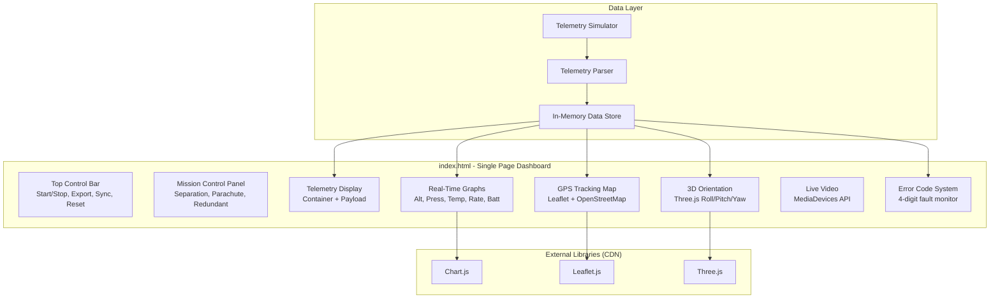

# ISLPro
ISL
# CanSat Ground Control Software (GCS) — Implementation Plan

A professional single-page Ground Control Software dashboard for a CanSat mission. The software monitors telemetry data in real time, visualizes mission parameters, displays GPS tracking, handles mission controls, and simulates aerospace mission operations.

## Source PDF
[cansat_and_cubesat_project.pdf](file:///C:/ISLProjects/cansat_and_cubesat_project.pdf)

---

## User Review Required

> [!IMPORTANT]
> **Technology choice**: The plan uses a single HTML file with vanilla JS and CDN libraries (Chart.js, Leaflet.js, Three.js). No build tools or frameworks. This keeps it simple and matches the assignment's suggested tools. Should I use a framework like Vite/React instead?

> [!IMPORTANT]
> **Simulated telemetry**: Since we don't have a physical microcontroller connected, telemetry data will be **simulated** via a JavaScript telemetry generator that mimics real CanSat packets. The Web Serial API integration will be stubbed but ready for real hardware.

> [!WARNING]
> **Web Serial API** requires HTTPS or localhost and a Chromium-based browser. It will not work in Firefox/Safari. The simulated telemetry mode will work everywhere.

---

## Proposed Changes

All files will be created in `c:\ISLProjects\cansat-gcs\`.

### Project Structure

```
cansat-gcs/
├── index.html          # Single-page dashboard (entry point)
├── css/
│   └── style.css       # Full aerospace-themed styling
├── js/
│   ├── app.js          # Main application controller
│   ├── telemetry.js    # Telemetry parser & simulator
│   ├── graphs.js       # Chart.js real-time graphs
│   ├── map.js          # Leaflet.js GPS tracking map
│   ├── orientation.js  # Three.js 3D orientation visualization
│   ├── video.js        # MediaDevices live video streaming
│   ├── errors.js       # 4-digit error code system
│   └── export.js       # CSV & graph export, data management
└── assets/
    └── (favicon, logo if needed)
```

---

### 1. Interface Layout — `index.html` + `css/style.css`

#### [NEW] [index.html](file:///C:/ISLProjects/cansat-gcs/index.html)
- Single-page dashboard with CSS Grid layout
- **Top bar**: Mission title, clock, connection status, control buttons
- **Left column**: Telemetry data panels (Container + Payload)
- **Center column**: Real-time graphs (Altitude, Pressure, Temperature, Descent Rate, Battery)
- **Right column**: GPS Map, Orientation 3D view, Video stream
- **Bottom bar**: Error code display, mission status, packet counter
- Dark aerospace theme with accent colors (cyan/green HUD style)

#### [NEW] [style.css](file:///C:/ISLProjects/cansat-gcs/css/style.css)
- **Color palette**: Deep navy/black background (#0a0e1a), cyan accents (#00e5ff), green status (#00ff88), red alerts (#ff3d3d), amber warnings (#ffb300)
- **Typography**: Google Font "Orbitron" for headers (space/tech feel), "Roboto Mono" for telemetry values
- CSS Grid for the main dashboard layout
- Glassmorphism panels with subtle borders and glow effects
- Smooth transitions and pulse animations for active indicators
- Responsive breakpoints for large screens (primary target: 1920×1080)

---

### 2. Top Control Bar — in `app.js`

#### [NEW] [app.js](file:///C:/ISLProjects/cansat-gcs/js/app.js)
- **Start Telemetry** / **Stop Telemetry** toggle buttons
- **Export CSV** button → triggers `export.js`
- **Export Graph** button → captures graph canvases as PNG
- **Sync PC Time** → syncs mission clock to system time
- **Reset Packet** → resets packet counter to 0
- Connection status indicator (Connected / Disconnected / Simulated)
- Real-time mission elapsed timer (MET)

---

### 3. Mission Control Panel — in `app.js`

- **Manual Separation** button with confirmation dialog
- **Emergency Parachute Deployment** button with warning modal and countdown
- **Redundant Activation** command
- Dynamic command execution status display (Sent → Acknowledged → Executed)
- Visual feedback: buttons glow/pulse when commands are in-flight
- Web Serial API stub for sending commands to real hardware

---

### 4. Telemetry Display — `telemetry.js`

#### [NEW] [telemetry.js](file:///C:/ISLProjects/cansat-gcs/js/telemetry.js)

**Telemetry Simulator** (generates realistic CanSat data):
- Simulates launch → ascent → apogee → descent → landing phases
- Fields: Team ID, Mission Time, Packet Count, Mode, State, Altitude, Pressure, Temperature, Voltage, GPS (Lat/Lon/Alt/Sats), Tilt X/Y, Rotation Rate, Payload state, CMD Echo
- Configurable update rate (1 Hz default)

**Telemetry Parser**:
- Parses CSV-formatted telemetry strings
- Separates Container and Payload telemetry
- Validates packet integrity

**Display**:
- Container telemetry panel with labeled fields
- Payload telemetry panel with labeled fields
- Values update with brief highlight animation on change
- Last packet timestamp display

---

### 5. Error Code System — `errors.js`

#### [NEW] [errors.js](file:///C:/ISLProjects/cansat-gcs/js/errors.js)

4-digit error code system:

| Digit | Condition              | 0 = Normal                  | 1 = Fault                        |
|-------|------------------------|-----------------------------|----------------------------------|
| 1     | Descent Rate           | Within 8–10 m/s             | Outside safe range               |
| 2     | GPS Availability       | GPS data available          | GPS data unavailable             |
| 3     | Payload Separation     | Separated successfully      | Separation failure               |
| 4     | Emergency Parachute    | Parachute inactive          | Emergency parachute activated    |

- Color-coded digit display: green (0) / red with pulse (1)
- Error history log with timestamps
- Audio alert on new fault condition (optional beep)

---

### 6. Real-Time Graphs — `graphs.js`

#### [NEW] [graphs.js](file:///C:/ISLProjects/cansat-gcs/js/graphs.js)

Using **Chart.js** (CDN):
- **Altitude vs Time** — line chart, cyan
- **Pressure vs Time** — line chart, amber
- **Temperature vs Time** — line chart, orange
- **Descent Rate vs Time** — line chart, green
- **Battery Voltage vs Time** — line chart, yellow

Features:
- Smooth real-time scrolling (rolling window of ~300 data points)
- Dark theme with grid lines matching dashboard aesthetic
- Tooltips on hover
- Auto-scaling Y-axis
- Each graph in its own panel with title and current value

---

### 7. Tracking Map — `map.js`

#### [NEW] [map.js](file:///C:/ISLProjects/cansat-gcs/js/map.js)

Using **Leaflet.js** (CDN) + **OpenStreetMap** tiles:
- Real-time marker showing current CanSat position
- Polyline trail showing mission trajectory/path history
- Custom marker icon styled to match dashboard theme
- Launch site marker
- Coordinate display overlay (Lat, Lon, Alt, Sats)
- Auto-center on latest position
- Zoom controls

---

### 8. Orientation Visualization — `orientation.js`

#### [NEW] [orientation.js](file:///C:/ISLProjects/cansat-gcs/js/orientation.js)

Using **Three.js** (CDN):
- 3D model of a simplified CanSat (cylinder + nose cone)
- Real-time rotation based on Roll, Pitch, Yaw telemetry
- Axes reference lines (X=red, Y=green, Z=blue)
- Numerical readout of Roll, Pitch, Yaw values
- Grid ground plane for spatial reference
- Smooth interpolated rotation (LERP)

---

### 9. Live Video Streaming — `video.js`

#### [NEW] [video.js](file:///C:/ISLProjects/cansat-gcs/js/video.js)

Using **MediaDevices API**:
- Camera selection dropdown (enumerates available devices)
- Start / Stop stream controls
- Stream status indicator (Live / Offline)
- Video element with dark border matching dashboard
- Fullscreen toggle
- Screenshot capture button

---

### 10. Data Management — `export.js`

#### [NEW] [export.js](file:///C:/ISLProjects/cansat-gcs/js/export.js)

- **CSV Export**: All telemetry packets logged in memory → export as `.csv` file
- **Graph Export**: Canvas-to-PNG for each graph → download as images
- **Packet Reset**: Clear packet counter and telemetry log
- **Telemetry Storage**: In-memory array of all received packets
- Uses Blob API + `URL.createObjectURL` for file downloads

---

### 11. Simulated Testing Strategy

Built into `telemetry.js`:
- Realistic mission phase simulation (pre-launch → ascent → apogee → separation → descent → landing)
- Configurable fault injection (GPS dropout, parachute activation, descent rate anomaly)
- Multiple scenario presets for testing all error code combinations
- Telemetry rate control (1–10 Hz)

---

## Architecture Diagram



---

## Verification Plan

### Manual Verification
1. Open `index.html` in Chrome/Edge
2. Click **Start Telemetry** — verify all panels update in real time
3. Verify all 5 graphs update smoothly with scrolling data
4. Verify GPS map shows moving marker with trail
5. Verify 3D orientation model rotates with telemetry
6. Verify error codes update correctly (inject faults via simulator)
7. Test mission controls (separation, parachute) — verify visual feedback
8. Test CSV export — verify downloaded file contains correct telemetry
9. Test graph export — verify PNG downloads
10. Test video stream — verify camera feed displays
11. Test on 1920×1080 resolution for optimal layout

### Automated Tests
- No automated test framework required (static HTML/JS project)
- Console logging for telemetry validation during development


# CanSat Ground Control Software (GCS) - Project Report

## Executive Summary
The **CanSat Ground Control Software (GCS)** is a comprehensive, web-based dashboard designed to monitor, control, and analyze telemetry data from a CanSat (a simulated satellite integrated within the volume and shape of a soft drink can) during its mission. Built with modern web technologies, it offers a zero-install, cross-platform solution for real-time mission operations, visualization, and post-flight analysis.

## Key Features

### 1. Real-Time Telemetry Processing
The GCS is capable of processing complex telemetry streams, maintaining separate data contexts for both the **Container** and the **Payload**. Tracked parameters include:
*   **Atmospheric Data:** Altitude, Pressure, Temperature
*   **Spatial Data:** GPS Latitude, Longitude, Altitude, and Satellite Count
*   **Dynamics:** Tilt (X/Y), Rotation Rate, Descent Rate
*   **System Health:** Battery Voltage, Mission Time, Packet Count, Software State

### 2. Mission Phase Tracking
The system automatically tracks and visually indicates the current flight phase based on telemetry data:
*   `PRE-LAUNCH` -> `ASCENT` -> `APOGEE` -> `SEPARATION` -> `DESCENT` -> `LANDED`

### 3. Flexible Data Acquisition Interfaces
To support various hardware setups and testing environments, the GCS implements multiple connection protocols:
*   **Web Serial API:** Direct, browser-to-hardware connection to serial radio receivers (e.g., XBee, LoRa modules) via USB, eliminating the need for middleware.
*   **WebSocket Bridge:** Allows connection to a local or remote Python backend (`telemetry_simulator/ws_bridge.py`), useful for routing data or integrating with external software.
*   **Internal Flight Simulator:** A built-in, physics-based telemetry simulator that models ascent, apogee, separation, parachute descent, and sensor noise. This allows teams to test the GCS UI and command logic without physical hardware.

### 4. Interactive Dashboard & Visualization
The user interface is designed for high-stress mission environments, prioritizing readability and situational awareness:
*   **Live Graphs:** Utilizes **Chart.js** to render real-time plots of Altitude, Pressure, Temperature, Descent Rate, and Battery Voltage.
*   **GPS Tracking:** Integrates **Leaflet.js** for real-time map plotting of the CanSat's coordinates.
*   **3D Orientation:** Employs **Three.js** to provide a live 3D visual representation of the CanSat's Roll, Pitch, and Yaw.
*   **Video Feed:** Interface for integrating live video streams from payload cameras.

### 5. Mission Control & Command Uplink
The dashboard includes an actionable command section allowing operators to send critical uplink commands to the CanSat:
*   Payload Separation Command
*   Emergency Parachute Deployment
*   Redundant Activation Commands

### 6. Testing & Fault Injection
Designed with robustness in mind, the simulator includes "Fault Injection" capabilities. Operators can deliberately trigger errors such as **GPS Dropouts** or **Descent Rate Anomalies** to train ground crews on emergency response and verify error-handling logic.

### 7. Data Logging & Export
*   **CSV Export:** All incoming telemetry is buffered and can be exported as a standard CSV file for post-mission data review and judging.
*   **Graph Export:** Visual charts can be exported directly as PNG images for inclusion in Post-Flight Review (PFR) documents.

## Technology Stack
*   **Frontend Structure & Styling:** HTML5, CSS3 (Custom Variables, Flexbox/Grid layouts for responsive design).
*   **Core Logic:** Vanilla JavaScript (ES6+).
*   **Visualization Libraries:** Chart.js (Data Plotting), Leaflet.js (Mapping), Three.js (3D Rendering).
*   **Simulator Backend (Optional):** Python 3 (`websockets` library).

## Conclusion
The CanSat GCS provides a robust, visually rich, and highly functional command center for CanSat teams. By leveraging modern browser APIs like Web Serial and WebSockets alongside powerful visualization libraries, it delivers professional-grade mission control capabilities while remaining accessible and easy to deploy.
